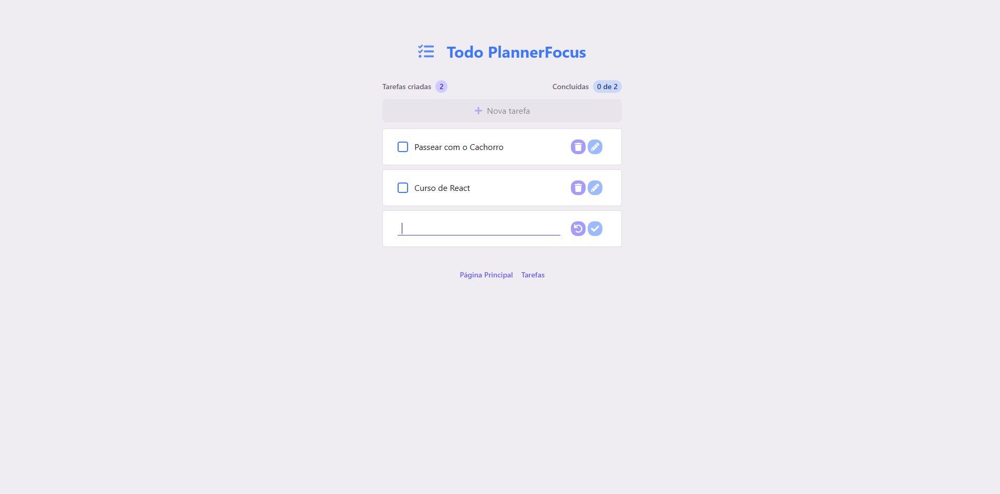

## Todo Optimized for PlannerFocus — TodoList (CVA + Custom Hooks + Fake HTTP)

O objetivo deste projeto foi criar uma arquitetura escalável com CVA (class-variance-authority) para variantes de UI de forma tipada e reutilizável (para evitar repetição de classes Tailwind.), com persistência em localStorage, hooks customizados e simulação de carregamento de HTTP com componentes Skeletons para estados de loading.
Stacks: `React`, `TypeScript`, `Tailwind` e `Vite` com Atomic Design.



## ✨ Conceitos Aplicados
React:
- Componentes Primitivos (Text, Button, Input, Container, etc) Polimórficos personalizados (`as` prop).
- Persistência de Dados para Tarefas via `localStorage` utilizando lib `use-local-storage`.
- Simulação de HTTP com delay() para exibir Skeleton/loading.
- Hooks customizados para manipulação de tarefas (useTask / useTasks encapsulando CRUD).
- Navegação com `React Router` no modo declarativo (declarative mode).

TypeScript
- Tipos fortes (com Schema) para Task
- Props tipadas em componentes atômicos com variantes de UI usando CVA

## 📏 Estrutura do Projeto
```bash
src/
  components/
    atoms/        # Button, Text, Container, Skeleton
    molecules/    # TaskItem, TaskSummary
    organisms/    # TaskList, Sections (Header&Footer)
    templates/    # Layouts
  domain/         # taskSchema (tipo e chave de storage)
  hooks/          # useTask, useTasks
  helpers/        # utils (delay)
  pages/          # Layout Global
  ```

## 🚀 Como Executar o Projeto
```bash
# Instale as dependências
npm install

# Rode o projeto em modo desenvolvimento
npm run dev
```